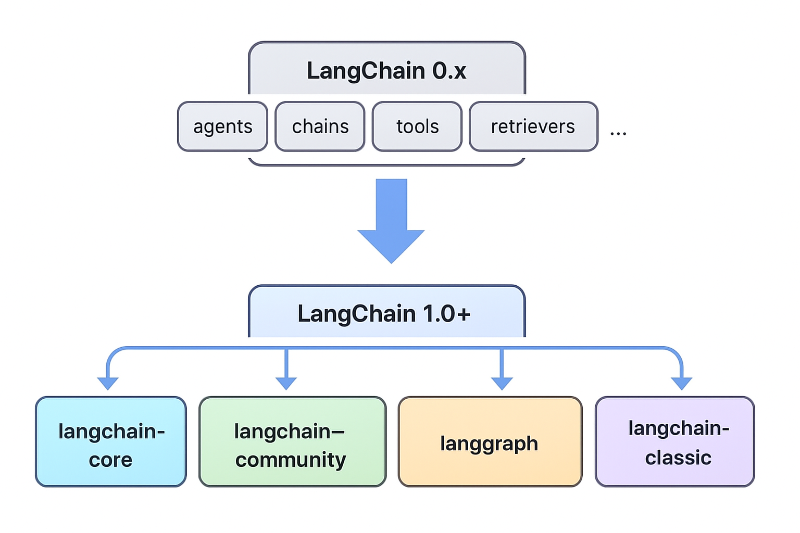

## 2.1 为什么要先讲版本变动

在学习langchain的时候，各种教程，示例都很混乱。0.x版本和1.0版本之间差别很大，现在的教程和代码同样也很混乱，如果不清楚两版本之间的区别，容易在学习时学岔，这也是我在学习langchain时遇到的问题。因此先分清楚新版本的特性和方法有助于避免在学习时陷入无法区分老版本的代码和教程的窘境。
## 2.2 综述



0.x版本（0.2、0.3 等）：单包/混合式设计，很多功能集中在 langchain 包里（agents、chains、tools、retrievers 等），API 频繁更改、破坏性更新较多。

1.0版本（含 langchain-core + langgraph）：框架进入稳定期、拆包模块化、agent loop 标准化、引入 middleware、结构化输出策略改进并把旧功能移到 langchain-classic。1.0 保证向前兼容（语义版本化）并承诺在 2.0 之前尽量不破坏 API。

| 维度            | 0.x 版本时代                        | 1.0 版本时代                                      | 变化本质                |
| ------------- | ------------------------------- | --------------------------------------------- | ------------------- |
| **定位**        | “工具箱”+高度灵活但混乱的生态                | 明确：**“LLM 应用框架”**                             | 明确边界、收敛 API         |
| **模块化**       | 分散、子包差异大                        | **Framework + Expression Language（LCEL）核心统一** | 统一范式                |
| **执行模式**      | Functions / Runnables 混杂        | **完全统一为 Runnable**                            | 核心抽象收敛              |
| **链式结构**      | Chains 类很多、不可组合                 | **链 = 函数 = Runnable，可组合，可流式**                 | 抹平接口差异              |
| **数据类型**      | 接受 dict 或对象，但限制多                | **输入输出都标准化为 Message / Dict**                  | 强类型统一               |
| **LLM 调用**    | ChatModel vs LLM API 差异大        | **统一成 RunnableLLM**                           | 简化模型封装              |
| **工具调用 Tool** | 设计分散                            | **统一到 Structured Tool + ToolNode**            | 和 ReAct/Agents 深度融合 |
| **Agents**    | 复杂、破碎、多种 Agent 类                | **Agents = Graph + Tools**（langgraph）         | 真正可控与可视             |
| **生态**        | langchain + langchain-community | 继续拆分，并引入 **LangGraph, LangSmith**             | 生态升级                |

| 功能    | 0.x                 | 1.0                     |
| ----- | ------------------- | ----------------------- |
| 主库    | langchain           | langchain（核心）           |
| 第三方集成 | langchain           | **langchain-community** |
| Agent | langchain.agents    | **langgraph（推荐）**       |
| 监控    | langchain callbacks | **LangSmith**           |

## 2.3 Runnable

什么是Runnable？  
Runnable是一个可以被执行、组合、流式、并发的“函数”。

简单理解来说，Runnable是langchain1.0中的唯一基础单元。 Runnable是在 LangChain 0.1.x 引入，1.0 完全成为核心抽象。

0.x 初期 → 没有 Runnable  
0.1.x → Runnable 出现并开始推广  
1.0 → Runnable 成为 LangChain 的基础架构

在langchain1.0中，**所有功能都被抽象为 Runnable**。
包括：
- Prompt（RunnablePrompt）
- LLM（RunnableLLM）
- ChatModel（RunnableChatModel）
- Parser（RunnableParser）
- Retriever（RunnableRetriever）
- Tool（RunnableTool）
- Sequential Chain
- Parallel Chain
- Router
- Agent 的 Node（LangGraph）
- 甚至 passthrough、lambda 都是 runnable

Runnable 是 LangChain 的“最小可执行单元”。
其他所有组件都“基于它”构建。Runnable为了实现“统一调用 + 可组合 + 可流式 + 可批量 + 可异步”而创造的抽象层。  


### 2.4 执行模式  
所有的Runnable都支持以下的执行模式：

| 模式           | 作用   |
| ------------ | ---- |
| `.invoke()`  | 单次执行 |
| `.batch()`   | 并发批量 |
| `.stream()`  | 流式输出 |
| `.ainvoke()` | 异步执行 |
| `.astream()` | 异步流式 |
| `.abatch()`  | 异步批量 |

>为什么要有执行模式？  
langchain1.0统一了Runnale后，为了消除旧api的混乱，统一为执行模式，这样任意的组件都可以以同样的方式运行。

### 2.5 LCEL
LCEL = LangChain 的声明式链式语言（DSL），
用来用“管道表达式”构建可组合的 Runnable 流水线。  

可以使用类似于linux中的管道|构建LLM应用。

例子：
```python
from langchain.chat_models import ChatOpenAI
from langchain.prompts import ChatPromptTemplate
from langchain.schema.output_parser import StrOutputParser

prompt = ChatPromptTemplate.from_template("Tell me a joke about {topic}")
model = ChatOpenAI()
parser = StrOutputParser()

chain = prompt | model | parser

```

### 2.6 langchain的核心组件

| 组件                | 中文    | 核心作用                            |
| ----------------- | ----- | ------------------------------- |
| Agents            | 智能体   | 自动决策和操作，调用工具完成复杂任务              |
| Models            | 模型    | 语言模型（LLM / ChatModel），生成文本、回答问题 |
| Messages          | 消息    | LLM 输入输出的标准化结构                  |
| Tools             | 工具    | 外部能力接口，如 API、数据库、计算函数           |
| Short-term memory | 短期记忆  | 存储上下文，支持会话连续性                   |
| Streaming         | 流式传输  | 实时输出 token，降低延迟                 |
| Structured output | 结构化输出 | 将 LLM 输出解析成可编程数据结构              |


