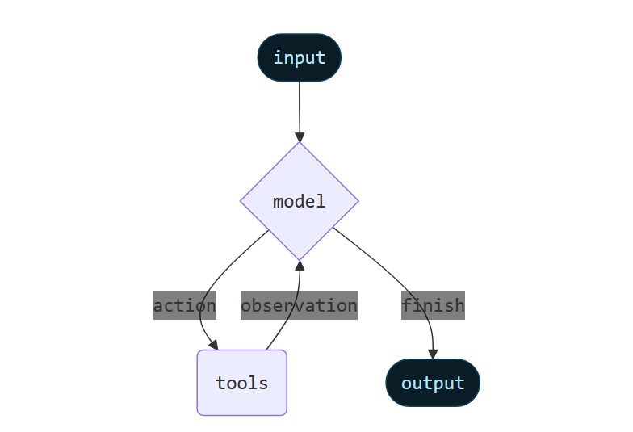

## 3.1 Model
Model指的就是大语言模型，Model一般包含以下的能力：
- 文本生成
- 工具调用
- 结构化输出
- 多模态
- 推理  

模型可以通过两种方式进行使用，
1. 在Agent中使用，创建Agent的时候指定Model
2. 独立使用，在Agent循环外使用，比如进行文本生成、分类提取等任务。

### 3.1.1 初始化模型
在langgchain1.0中，统一的初始化模型接口为**ChatOpenAI**  
例如：

```python

llm = ChatOpenAI(
    model="gpt-4.1",
    temperature=0,
)

llm = ChatOpenAI(
    model="glm-4-flash",
    api_key=api_key,
    base_url="https://open.bigmodel.cn/api/paas/v4/",
    temperature=0.5,
    timeout=10,
    max_tokens=1000
)
```


### 3.1.2 ChatOpenAI的参数
| 参数                  | 类型      | 默认值               | 作用                    | 备注                                           |
| ------------------- | ------- | ----------------- | --------------------- | -------------------------------------------- |
| `model`             | `str`   | `"gpt-3.5-turbo"` | 指定模型名称                | 可选 `"gpt-4"`, `"gpt-4.1"`, `"gpt-4o-mini"` 等 |
| `temperature`       | `float` | 1.0               | 控制生成随机性               | 0 → deterministic；越高越 creative               |
| `max_tokens`        | `int`   | None              | LLM 最大生成 token 数      | None 时使用模型默认                                                          |
| `frequency_penalty` | `float` | 0.0               | 减少重复                  | 0-2                                          |
| `model_kwargs`      | `dict`  | None              | 直接传给 OpenAI API 的额外参数 | 例如 `{"stop": ["###"]}`                       |
| `api_key`      | `str`  | None              | OpenAI API Key | 推荐 SecretStr("sk-xxx") 或函数 lambda: "sk-xxx"                       |
| `base_url`      | `str`  | None              | 自定义 OpenAI endpoint | 用于私有部署                      |
| `timeout`      | `float`  | None              | 超时时间 | 用控制向大模型请求时的超时                      |


## 3.2 Agents
>Agents combine language models with tools to create systems that can reason about tasks, decide which tools to use, and iteratively work towards solutions.  

在langchain的官方文档中，是这么介绍Agents的，“Agents是将语言模型和工具相结合，是能创建推理任务、决定使用哪些工具并逐步解决问题的系统。”

Agent通过循环，来实现目标，只有当模型完成最终输出或达到迭代上限的时候才会结束运行。



create_agent 使用 LangGraph 构建一个基于「图」(graph-based) 的智能体。一个图由 节点（nodes） 和 边（edges） 组成，它们共同定义了智能体如何处理信息。  
智能体会在图中移动，依次执行不同的节点，例如：
- model 节点：调用模型（LLM）
- tools 节点：调用工具（tools）
- middleware：中间处理逻辑

这些节点之间的连接（edges）定义了智能体的执行流程和行为。
